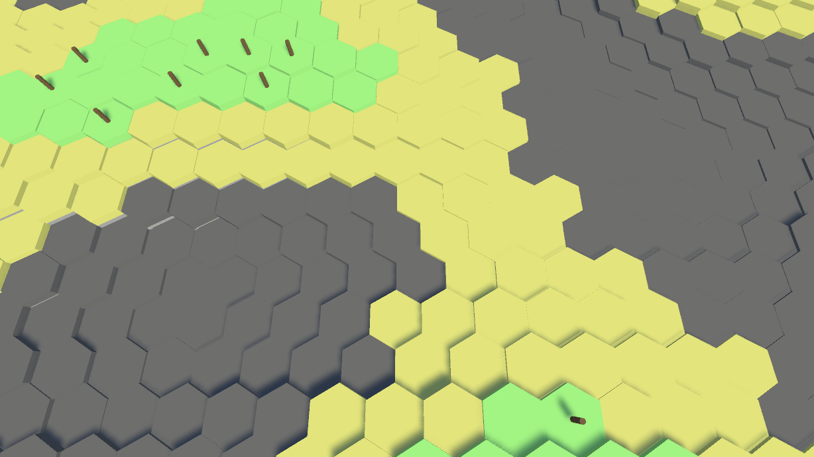

# Procedural Hexagon Terrain

The Project is UPGRADING, it might not be usable currentnly!

--------------------------------------------------
It is very prototypal in its current form. For a demo, see Scenes/Sample Scene.

## How to use?

Create an empty game object and attach the HexagonTerrain component to it.

Create a TerrainRegionAssets scriptable object as the setting of the HexagonTerrain instance.

Create a TerrainFormAssets scriptable object as a terrain form setting of the TerrainRegionAssets instance.

Drag some terrain cylinder prefabs and terrain decoration prefabs into relevant slots in the TerrainFormAssets instance, set up their appearance heights, and choose a procedural algorithm.

Press Play to see the unlimited procedurally generated hexagon terrain.

